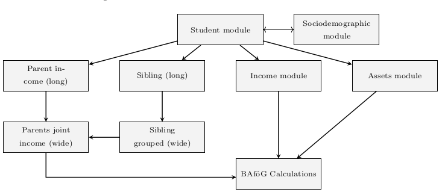

## BAföG Microsimulation Pipeline

A modular Python pipeline for simulating theoretical BAföG (student financial aid) entitlements in Germany. Built using SOEP-Core v39, it estimates eligibility, computes expected awards, and generates descriptive statistics for analysis and policy research.

This pipeline supports research on take-up behavior, distributional impacts, and student aid reform.

---

## ⚙️ Features

* 📦 **Modular architecture**: clear separation of loading, calculation, filtering, and exporting stages.
* 🧮 **Eligibility engine**: simulates BAföG entitlements based on current legal statutes.
* 🧲 **Eligibility engine**: simulates BAföG entitlements based on current legal statutes.
* 📊 **Descriptive statistics**: supports subgroup analysis and conditional probability reporting.
* 📤 **Export options**: export results in Excel and Parquet formats.
* 🔧 **Fully configurable**: paths and parameters set via `config/config.json`.

---

## 🧰 Requirements

* Python 3.10+
* Dependencies listed in `requirements.txt`
* Access to SOEP-Core v39

---

## 🚀 Getting Started

1. **Clone the repository**:

   ```bash
   git clone https://github.com/your-username/msc-thesis-v4.git
   cd msc-thesis-v4
   ```

2. **Install dependencies**:

   ```bash
   pip install -r requirements.txt
   ```

3. **Configure paths and toggles**:
   Edit `config/config.json`:

   ```json
   {
     "paths": {
       "data": {
         "soep": "~/Data/SOEP-Core/CSV/soepdata/",
         "destatis": "~/Data/Destatis/",
         "public_data": "~/Code/msc-thesis-v4/public_data/",
         "soep_cached": "~/Data/SOEP-Core_cached/"
       },
       "results": {
         "figures": "~/Downloads/figures/",
         "tables": "~/Downloads/tables/",
         "dataframes": "~/Downloads/dataframes/"
       }
     }
   }
   ```

4. **Run the simulation and export**:

   ```bash
   python3 -m export.export_xlsx
   python3 -m export.export_parquet
   ```

5. **Generate descriptive outputs**:

   ```bash
   python -m descriptives.core.run
   ```

---

## 📁 Project Structure

```
msc-thesis-v4/
├── pipeline/            # Core BAföG simulation logic
├── descriptives/        # Summary statistics, subgroup analysis
├── export/              # Excel and Parquet exporters
├── loaders/             # SOEP and registry data loading
├── misc/                # Utility helpers
├── config/              # Configuration files
├── public_data/         # Policy parameters, thresholds
├── tests/               # Unit tests
├── data_handler.py      # High-level pipeline coordinator
```

---

## 📊 Public Datasets

All policy inputs live in `public_data/`. These drive the simulation logic.

### Income Tax

* `Income Tax.csv` — Income tax brackets and marginal rates

### Basic Allowances (BAföG)

* `Basic Allowances - § 12.csv`
* `Basic Allowances - § 13.csv`
* `Basic Allowances - § 13a.csv`
* `Basic Allowances - § 23.csv`
* `Basic Allowances - § 25.csv`
* `Basic Allowances - § 29.csv`

### Solidarity Surcharge

* `Solidaritätszuschlag.csv` — 5.5% surcharge on income tax

### Social Insurance

* `Sozialversicherung - § 21.csv` — Pension, health, and unemployment insurance rates

### Deductions & Indexing

* `Werbungskostenpauschale.csv` — Standard deduction
* `Average Wage Timeseries.csv` — Indexed wage levels (currently unused)

---

## 🗂️ Configuration

Centralized configuration via `config/config.json`. Define:

* Input/output paths
* Feature toggles
* Scenario-specific settings

---
## 📋 Data and Legal Sources

The project is based on:

* **SOEP-Core v39** by DIW Berlin (access required)
* Statutory parameters from:

  * Bundesministerium für Bildung und Forschung (BMBF)
  * Bundesgesetzblatt
  * Statistisches Bundesamt (Destatis)

---

## 🔖 License

MIT License — free to use, modify, and distribute with attribution. See `LICENSE` for terms.

---

## 👤 Authors

* **Alexander Eriksson Byström**
  [@alexerby](https://github.com/alexerby)
* **Maria Sól Antonsdottír**

---

## 🙌 Acknowledgments

* DIW Berlin for SOEP-Core data access
* BMBF and official BAföG publications

---

## 🔄 Pipeline Overview



*Figure: Modular structure and data flow in the BAföG microsimulation pipeline*

---

## 📄 Related Thesis

This project supports the thesis:

***Unclaimed Aid in the German Student Aid System***
*A Microsimulation of BAföG Eligibility and Non-Take-Up*
📄 [Thesis LaTeX source](https://github.com/Alexerby/master-thesis-tex)

Includes detailed methodology, data sources, and empirical findings.
