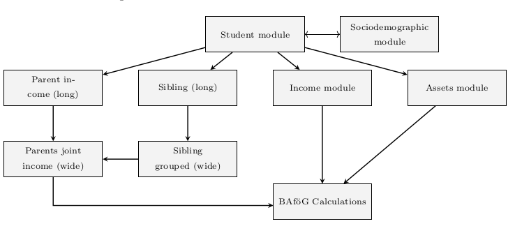

# BAföG Microsimulation Pipeline

A modular Python pipeline for computing theoretical BAföG (student financial aid) entitlements in Germany. The pipeline uses individual- and household-level data (primarily from SOEP-Core v39) to simulate eligibility, calculate expected award amounts, generate descriptive statistics, and export results for further analysis or reporting.

This project is intended for research purposes, particularly to study student financial aid take-up, distributional effects, and policy design.

---

## ⚙️ Features

- 📦 **Modular pipeline architecture**: clearly separated components for preprocessing, calculation, filtering, and export.  
- 🧮 **BAföG simulation engine**: determines theoretical eligibility and benefit amounts under current legal rules.  
- 📊 **Descriptive statistics**: generates summary statistics, conditional probabilities, and tables for students, parents, and subgroups.  
- 📤 **Export utilities**: supports export of results in Parquet and Excel formats for post-processing or publication.  
- 🔧 **Configurable design**: paths, policy parameters, and toggles are externally configurable via JSON.

---

## 🧰 Requirements

- Python 3.10+  
- Required libraries listed in `requirements.txt`  
- Access to SOEP-Core data (version v39) and basic understanding of the dataset structure  

---

## 🚀 Getting Started

1. Clone the repository:
   ```bash
   git clone https://github.com/your-username/msc-thesis-v4.git
   cd msc-thesis-v4
   ```

2. Install dependencies:
   ```bash
   pip install -r requirements.txt
   ```

3. Configure file paths and options by editing:
   `config/config.json`

   Example:
   ```json
   {
     "paths": {
       "data": {
         "soep": "~/Data/SOEP-Core/CSV/soepdata/",
         "destatis": "~/Data/Destatis/",
         "public_data": "~/Code/msc-thesis-v4/public_data/",
         "soep_cached": "~/Data/SOEP-Core_cached/"
       },
       "results": {
         "figures": "~/Downloads/figures/",
         "tables": "~/Downloads/tables/",
         "dataframes": "~/Downloads/dataframes/"
       }
     }
   }
   ```

4. Run the simulation pipeline and export to .xlsx/.parquet:
   ```bash
   python3 -m export.export_xlsx
   python3 -m export.export_parquet
   ```

5. Generate descriptive statistics:
   ```bash
   python -m descriptives.core.run
   ```

---

## 📁 Project Structure

```
msc-thesis-v4/
├── pipeline/            # Main BAföG simulation logic (calculation, filters, inputs)
├── descriptives/        # Code to compute summary statistics, conditional probabilities, and tables
├── export/              # Output to Parquet, XLSX
├── loaders/             # SOEP registry and other data loading helpers
├── misc/                # Utility functions and decorators
├── config/              # Configuration JSON for setting paths, toggles
├── public_data/         # CSV files with statutory values and policy parameters
├── tests/               # Unit tests for selected modules
├── data_handler.py      # High-level orchestration and coordination
└── pyrightconfig.json   # Optional type-checking config
```

---

## 📈 Public Datasets

Located in `public_data/`, these files provide statutory parameters and thresholds used throughout the simulation pipeline.

### 📊 Income Tax
- `Income Tax.csv` — Federal income tax brackets and marginal rates.

### 🧾 Basic Allowances
Used to determine allowable deductions or exempt income levels under BAföG rules:

- `Basic Allowances - § 12.csv`  
- `Basic Allowances - § 13.csv`  
- `Basic Allowances - § 13a.csv`  
- `Basic Allowances - § 23.csv`  
- `Basic Allowances - § 25.csv`  
- `Basic Allowances - § 29.csv`

### 💼 Solidarity Surcharge
- `Solidaritätszuschlag.csv` — Surcharge (5.5%) levied on income tax.

### 🛡️ Social Insurance Contributions
- `Sozialversicherung - § 21.csv` — Public health, pension, and unemployment insurance rates.

### 📉 Deductions and Indexing References
- `Werbungskostenpauschale.csv` — Standard income-related deduction.  
- `Average Wage Timeseries.csv` — Indexed wage levels (currently unused in core logic).

---

## 📂 Configuration

All paths and options are defined in `config/config.json`, including:

- Input data locations  
- Output destinations for figures/tables  
- Optional feature toggles or scenario parameters

---

## 📚 Data Sources and Licensing

This project relies on **SOEP-Core v39**, a representative panel dataset provided by the German Institute for Economic Research (DIW Berlin). Access requires approval from [https://www.diw.de/soep](https://www.diw.de/soep).

Legal parameters (e.g., thresholds and allowances) are sourced from:

- Bundesministerium für Bildung und Forschung (BMBF)  
- Bundesgesetzblatt  
- Statistisches Bundesamt (Destatis)

---

## 📄 License

MIT License — free to use, modify, and distribute with attribution. See `LICENSE` for full terms.

---

## 👤 Authors

**Alexander Eriksson Byström**  
[@alexerby](https://github.com/alexerby)

**Maria Sól Antonsdottír**

---

## 🙌 Acknowledgments

- DIW Berlin for SOEP-Core data  
- BMBF and official BAföG documents  
- OpenAI's ChatGPT for technical assistance

---

## 🔄 Pipeline Overview



*Figure: End-to-end pipeline overview with grouped raw SOEP sources*

---

## 📄 Related Thesis

This microsimulation pipeline was developed as part of the MSc thesis:

**_Unclaimed Aid in the German Student Aid System_**  
_A Microsimulation of BAföG Eligibility and Non-Take-Up_  
→ [View the thesis LaTeX source](https://github.com/Alexerby/master-thesis-tex)  
→ [PDF (if public)](https://example.com/thesis.pdf) *(optional)*

The thesis includes formal documentation of the simulation model, data processing methods, and empirical results.
